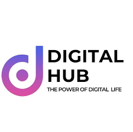
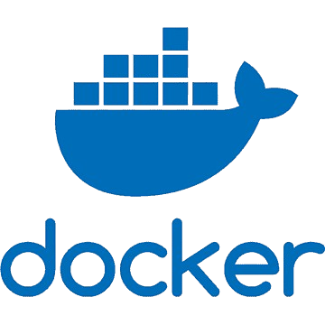
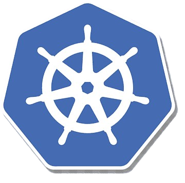

# Orange Digital Center Training Tasks and Projects

  
  
  
  
  

## Table of Contents
- [Main Projects](#main-projects)
  - [Final Project - Complete CI/CD pipeline](#final-project-complete-cicd-pipeline)
  - [Project Week 03 - Jenkins on K8s](#project-week-03-jenkins-on-k8s)
  - [Project Week 02 - Kubernetes Deployment](#project-week-02-kubernetes-deployment)
  - [Project Week 01 - Dockerized Three-Tier Application](#project-week-01-dockerized-three-tier-application)
- [Offline Folders](#offline-folders)
- [Project Documentation](#project-documentation)

## Main Projects

### [Final Project - Complete CI/CD pipeline](https://github.com/zscbana/ODC-Final-Project-CI-CD)
This project focuses on building a complete CI/CD pipeline for the Orange Digital Center training. It involves multiple tools and technologies including:
- **Jenkins** for CI/CD automation
- **Docker** for containerization of applications
- **Kubernetes** for container orchestration
- **ArgoCD** for continuous delivery in Kubernetes environments
- **Ubuntu VM** for the CI stage, where dependencies are installed, unit tests are run, and builds are created in the local environment.
- **Azure Cloud** to set up the **Ubuntu VM** for the CI stage, where Docker images are built and pushed to Docker Hub repositories.

### [Project Week 03 - Jenkins on K8s](https://github.com/zscbana/Orange-DevOps/tree/main/Week03/Project)
This project involves configuring Jenkins within a Kubernetes cluster. Key tasks include:
- Deploying Jenkins inside Kubernetes
- Configuring **Roles** and **RoleBinding** in Kubernetes to grant Jenkins the necessary permissions for deploying applications via pipelines inside a specific namespace

### [Project Week 02 - Kubernetes Deployment](https://github.com/zscbana/Orange-DevOps/tree/main/Week02/Project)
This project involves creating Kubernetes deployments for each tier of the application (Proxy, Backend, and Database), each with two replicas. The goal is to ensure that these tiers are scalable and highly available in a Kubernetes environment.

### [Project Week 01 - Dockerized Three-Tier Application](https://github.com/zscbana/Orange-DevOps/tree/main/Week01/Project)
The first project is about creating a **Dockerized three-tier application**, which includes:
- **Frontend**, **Backend**, and **Database** tiers
- Using **Docker** concepts to containerize the application
- Using **Docker Compose** to manage multi-container deployments for easy setup and orchestration

## Offline Folders

In each week's project, you will find an **Offline** folder containing labs and tasks that were required to be done offline.

## Project Documentation

Each project folder contains a **README** file that documents the details, steps, and configuration for that specific project. Just check the links to access the README documentation for each project.
